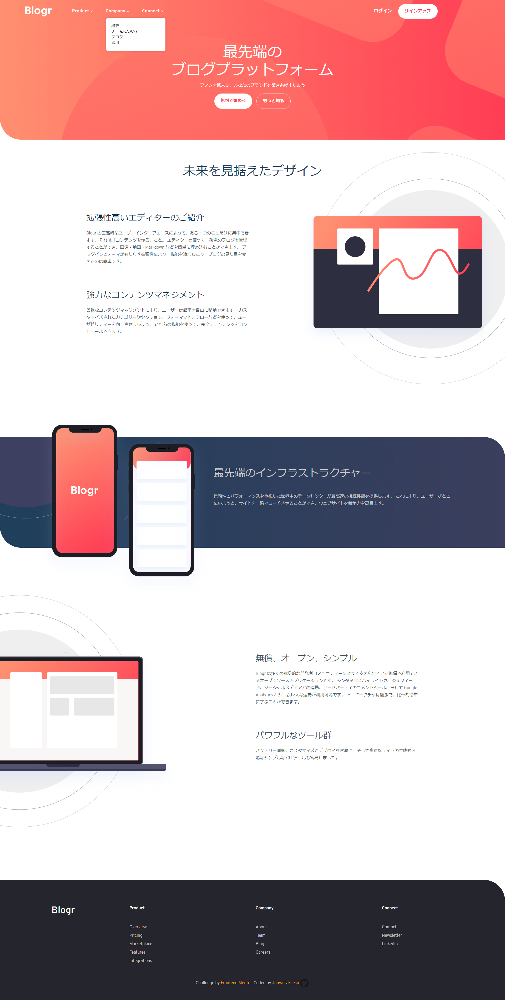
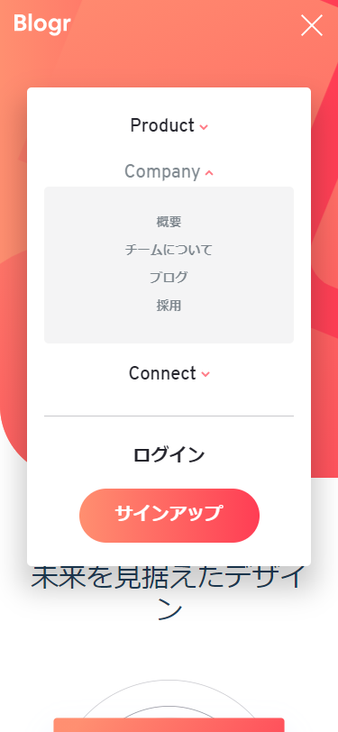

# Frontend Mentor - Blogr landing page solution

This is a solution to the [Blogr landing page challenge on Frontend Mentor](https://www.frontendmentor.io/challenges/blogr-landing-page-EX2RLAApP). Frontend Mentor challenges help you improve your coding skills by building realistic projects.

## Overview

### The challenge

Users should be able to:

- View the optimal layout for the site depending on their device's screen size
- See hover states for all interactive elements on the page

### Screenshot

### Links

- Solution URL: [My solution](https://github.com/Junya-Takaesu/FrontendMentorBlogr)
- Live Site URL: [The site on github page](https://junya-takaesu.github.io/FrontendMentorBlogr/)

## My process

### Built with

- Bootstrap 5
  - Used Bootstrap for layouts like grid and flexbox.
- Minimum CSS
  - Because I was able to style the site using Bootstrap classes to style elements, I used minimum CSS.
  - Used sass to create structured styles which makes it easy for me to understand which styles apply which elements.
- Vanilla JS
  - No libraries used, so that codebase is unreasonably huge considering the scale of this challenge project.
  - Should've used any libraries like jQuery in the hindsight.(Plus side is I learned a lot about javascript.)
- Translate texts into Japanese because I live in Japan.

### What I learned
- How to leverage Bootstrap5 to create layout.
  - Use the Bootstrap's grid system to easily put things in responsive way.
- A lot of CSS
  - Even though I used Bootstrap 5 for layout, I needed to use a lot of CSS(in sass format) to align things as they are defined in design.

### Continued development

- Use any JS libraries to make it easier to style the page and add animations.
- Compiling like webpack.
- Best practice for sass.

### Useful resources

- How to create dropdown menu with animation
  - https://codinhood.com/micro/10-dropdown-menu-animations-css-transform
- Bootstrap5 documentation
  - https://getbootstrap.com/docs/5.0/getting-started/introduction/
## Acknowledgments

- Add someone
